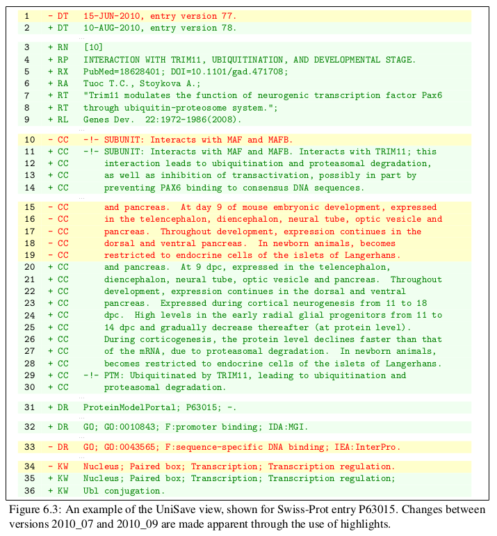

UniSave2LaTeX
=============

Code that allows UniSave output to be converted to LaTeX tables.

##Example

The image below shows output from LaTeX from UniSave for entry
[(P63015)](http://www.uniprot.org/uniprot/P63015?version=78&version=77)



The raw TeX and input are provided in "LaTeX-Output.txt" and
"input.txt", respectively.

##Usage

LaTeX requires the use of the "xcolor" and "colortbl" packages:

`\usepackage{xcolor, colortbl}`

And definitions of the colours for the background and font:

```\definecolor{bgGreen}{HTML}{F0FFF0}
\definecolor{fntGreen}{HTML}{008000}
\definecolor{bgRed}{HTML}{FFFFCC}
\definecolor{fntRed}{HTML}{FF0000}
\definecolor{fntDots}{HTML}{C0C0C0}```

To run the code the UniSave text needs to be placed into a text file, and
then ran from Java like:

`java UniSave2LaTeX input.txt`

where "input.txt" contains the UniSave text. The ouput will be saved
in "LaTeX-Output.txt". Examples of input.txt and the generated
LaTeX-Output.txt are provided.

##Author 

Michael Bell, Newcastle University
[(homepage)](http://www.michaeljbell.co.uk).

## License

The contents of this file are subject to the LGPL License, Version
3.0.

Copyright (C) 2013, Newcastle University

This program is free software: you can redistribute it and/or modify
it under the terms of the GNU Lesser General Public License as
published by the Free Software Foundation, either version 3 of the
License, or (at your option) any later version.

This program is distributed in the hope that it will be useful, but
WITHOUT ANY WARRANTY; without even the implied warranty of
MERCHANTABILITY or FITNESS FOR A PARTICULAR PURPOSE. See the GNU
General Public License for more details.

You should have received a copy of the GNU Lesser General Public
License along with this program. If not, see
http://www.gnu.org/licenses/.


